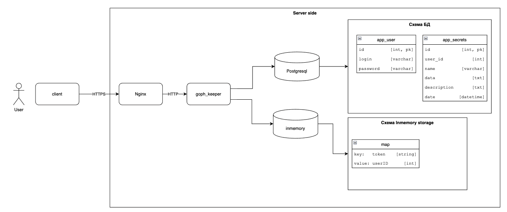

# GophKeeper

GophKeeper представляет собой клиент-серверную систему, 
позволяющую пользователю надёжно и безопасно хранить логины, 
пароли, бинарные данные и прочую приватную информацию.

# Схема приложения

**В данном разделе отражается только реализованный на данный момент функционал**

## Dev

Подходит для тестового развертывания/разработки, не рекомендуется для продакшн.


## Prod

Рекомендуемая схема:
- Терминация TLS на nginx, а не в app т.к. шифрование довольно дорогая для CPU операция.
  Совместно с бизнес логикой приложения и обильным логированием может привести к довольно интересным последствиям.
  В данном случае nginx может быть как отдельный инстанс так и ingress k8s если это позволяет дизайн кластера.



# Локальный запуск приложения

Запустить Psql из docker-compose в директории `deployments`
```shell
docker-compose up
```

Запустить сервер с ключами 
```shell
go run cmd/gophkeeper/main.go -a 127.0.0.1:8080 -d "host=localhost port=5432 user=gop_keeper_dev password=gop_keeper_dev dbname=gop_keeper_dev sslmode=disable connect_timeout=5"
```
или переменными окружения
```shell
export RUN_ADDRESS="127.0.0.1:8080"
export DATABASE_URI="host=localhost port=5432 user=gop_keeper_dev password=gop_keeper_dev dbname=gop_keeper_dev sslmode=disable connect_timeout=5"
go run cmd/gophkeeper/main.go
```

По умолчанию, для БД будет применена последняя версия миграций.
Если необходимо использовать конкретную версию можно использовать ключ `-m` или переменную `MIGRATION_DOWN_TO`:
```shell
go run cmd/gophkeeper/main.go -a 127.0.0.1:8080 -m 20221227191000
```
или 
```shell
export MIGRATION_DOWN_TO="001"
```

# HTTP API сервиса

## Регистрация пользователя
**Request**

POST `/api/v1/auth/signup`
 ```json
{
  "login": "example_login",
  "password": "example_pwd"
}
```

**Response**  

- 201 - пользователь зарегестрирован
  ```
  HTTP Authorization: {{Token}}
  ```
- 400 - не верный формат зароса
- 409 - пользователь уже существует
- 500 - внутренняя ошибка сервера

## Вход пользователя
**Request**

POST `/api/v1/auth/signin`
```json
{
  "login": "example_login",
  "password": "example_pwd"
}
```

**Response**
- 201 - пользователь аутентифицирован
  ```
  HTTP Authorization: {{Token}}
  ```
- 400 - не верный формат зароса
- 401 - пользователь не аутентифицирован
- 500 - внутренняя ошибка сервера

## Выход пользователя

**Request**

DELETE `/api/v1/auth/signout/`
```
HTTP Authorizations: {{Token}}
```

**Response**

- 200 - пользовательская сессия удалена

## Создать секрет

**Request**

POST `/api/v1/secret/create`
```
HTTP Authorization: {{Token}}
```
```json
{
  "name": "title",
  "data": "hashOfSecret+salt",
  "description": "example"
}
```

**Response**

- 201 - секрет создан
- 400 - не верный формат зароса
- 401 - пользователь не аутентифицирован
- 500 - внутренняя ошибка сервера

## Список секретов

**Request**

GET `/api/v1/secret/list`
```
HTTP Authorization: {{Token}}
```

**Response**

- 200 - вернул список секретов
- 401 - пользователь не аутентифицирован
- 500 - внутренняя ошибка сервера

## Получить секрет по ID

**Request**

GET `/api/v1/secret/{secretID}`
```
HTTP Authorization: {{Token}}
```

**Response**

- 200 - вернул секрет по ID
- 400 - не верный формат запроса. Для secretID могут использоватся только цифры.
- 401 - пользователь не аутентифицирован
- 404 - секрета с таким ID не существует
- 500 - внутренняя ошибка сервера

## Обновить секрет

**Request**

PUT `/api/v1/secret/update`
```
HTTP Authorization: {{Token}}
```
```json
{
    "id": 10,
    "name": "title",
    "data": "hashOfSecret+salt",
    "description": "hello world"
}
```

**Response**

- 201 - секрет усакшно обновлен
- 400 - не верный формат запроса
- 401 - пользователь не аутентифицирован или не авторизован
- 500 - внутренняя ошибка сервера

##  Удалить секрет

**Request**

DELETE `/api/v1/secret/{secretID}`
```
HTTP Authorization: {{Token}}
```

**Response**

- 201 - серет успешно удален